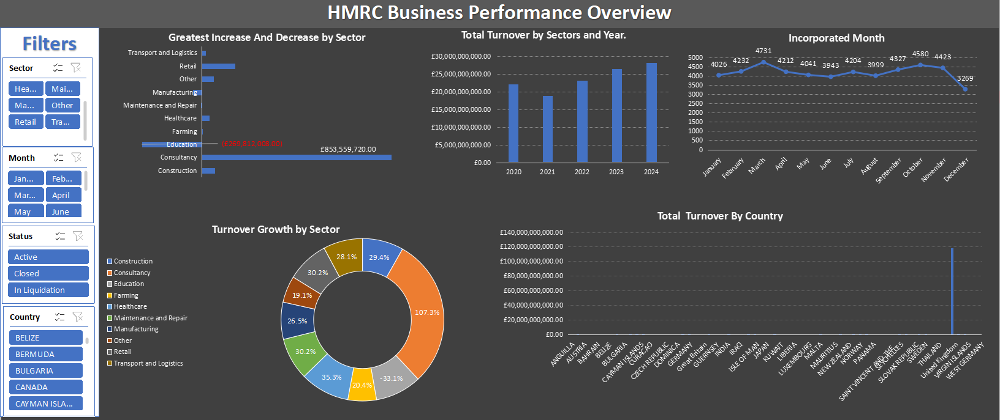

# Data Analytics Portfolio

# Project 1

**Title:** [HMRC Business Turnover Analytics (Multisector & Multinational)]([https://github.com/adeolammy/Adebajo_Adewale.github.io/blob/main/Adidas-Dashboard-START.xlsx](https://github.com/adeolammy/Adebajo_Adewale.github.io/blob/main/HMRC_DATA.zip))

**Tools Used:** Microsoft Excel (Pivolt table, Pivolt Chart, Filters and Slicers and timelines, Conditional Formatting)

**Project Description:**
This Power BI dashboard provides an analytical view of turnover trends across various sectors and countries over multiple years. It enables stakeholders to track sectoral performance, compare annual turnover, and evaluate country-wise contributions. Filters allow for flexible exploration by company, month, status, and country, making it an interactive and dynamic tool for data-driven decisions.

**Key Features of the Dashboard:** 

-Interactive Filters: Allows users to drill down data by Company, Month, Status (e.g., Active, Closed, In Liquidation), and Country.

-Sectoral Comparison: Visuals highlight turnover growth and decline by sector, emphasizing top gainers and losers.

-Yearly Trends: Bar chart tracks total turnover across years (2020–2024).

-Monthly Incorporation Activity: Line chart shows the number of incorporations per month, revealing seasonality or regulatory trends.

-Country Analysis: Bar chart aggregates total turnover by country, emphasizing geographic concentrations of economic activity.

-Donut Chart: Illustrates relative turnover growth across sectors as a percentage.

**Track Key Performance Metrics:**

**Greatest Increase by Sector:**

-Consultancy showed the most significant increase, with a turnover growth of £853,559,720.00.

**Greatest Decrease by Sector:**

-Education had the most notable decline, with a turnover reduction of £269,812,008.00 (in red).

**Year-over-Year Turnover Trend:**

-Continuous growth from 2021 to 2024, with the highest turnover in 2024 (~£28 billion).

**Monthly Incorporation Peak:**

-March had the highest incorporations (4731), while December showed a significant drop (3269).

**Turnover Growth (Donut % Breakdown):**

**-Top sectors by growth:**

-Consultancy (107.3%)

-Construction (35.3%)

-Maintenance and Repair (30.2%)

-Negative growth:

Education (-33.1%)

**Top Country by Turnover:**

-United Kingdom significantly outperformed others, reaching near £120 billion+.

**Key Findings:** 

**1. Sectoral Dynamics:**

-Consultancy is the most rapidly expanding sector both in absolute value and percentage growth.

-Education is in decline, potentially due to policy shifts, digital disruption, or funding cuts.

**2. Annual Turnover Trend:**

-A steady upward trajectory suggests economic recovery or strategic market expansion.

**3. Country Disparity:**

-UK dominates turnover generation, pointing to its central role in the data pool or possibly headquarters concentration.

**4. Incorporation Trends:**

-There’s a cyclical pattern, with Q1 (esp. March) typically seeing more incorporations—could indicate budget cycles, fiscal planning, or tax optimization strategies.

**5. Operational Health:**

-Active statuses dominate, but the presence of Closed and In Liquidation companies signals volatility in certain sectors or regulatory pressures.

**Dashboard Overview**

<!--
-->

# Project 2

**Title:** [Adidas Sales Dashboard](https://github.com/adeolammy/Adebajo_Adewale.github.io/blob/main/Adidas-Dashboard-START.xlsx)

**Tools Used:** Microsoft Excel (Pivolt table, Pivolt Chart, Filters and Slicers and timelines, Conditional Formatting)

**Project Description:** This project involves analyzing Adidas sales data to provide a detailed and interactive dashboard for tracking sales performance across different dimensions. The dashboard serves as a powerful tool for visualizing sales trends and supporting strategic decision-making.

Key Features of the Dashboard:
Retailer Performance

A bar chart showcasing total sales by retailer, enabling stakeholders to identify high-performing partners like Amazon, Foot Locker, and Walmart.
Regional Insights

A regional sales chart highlighting performance in different parts of the U.S. (e.g., Midwest, Northeast, Southeast, etc.), helping to pinpoint strong and underperforming regions.
Sales Method Distribution

A pie chart summarizing sales contributions from various methods (In-store, Online, Outlet), providing insights into channel effectiveness.
Product Sales Analysis

A breakdown of sales performance across product categories (Men's and Women's Apparel, Footwear) using a comparative bar chart.
Total Sales Trends

A dynamic line graph displaying total sales, trends over time, giving an overview of sales growth and consistency.
Interactive Slicers:
The dashboard includes several filters for detailed analysis:

Retailer: Focus on specific retail partners like Amazon or Foot Locker.
Region: Analyze performance by geographical areas in the U.S.
Product: Drill down into specific product categories to understand their contributions.
Sales Method: Filter data based on in-store, online, or outlet sales.
Objective and Benefits:
This dashboard enables Adidas to:

Track Key Performance Metrics: Monitor and analyze performance across various dimensions in real-time.
Identify Opportunities for Growth: Uncover insights into underperforming regions or channels.
Support Data-Driven Decisions: Inform strategic initiatives such as marketing campaigns, resource allocation, and inventory management.
Developed with interactivity and usability in mind, this dashboard is a vital tool for Adidas to enhance operational efficiency and achieve its business goals.

**Key findings:** 
Top-Performing Retailers:

Retailers like West Gear and Kohl’s generated the highest sales volumes, indicating strong partnerships and effective distribution in these channels.
Sports Direct and Walmart showed lower sales performance, suggesting potential areas for improvement in collaboration or market penetration.
Regional Sales Insights:

The West region leads in total sales, demonstrating significant market dominance.
The Northeast and Southeast regions exhibit moderate performance, while the Midwest and South regions lag behind, presenting opportunities for targeted marketing and sales strategies.
Product Performance:

Men's Athletic Footwear and Men’s Apparel dominate sales, reflecting customer preference and strong market demand in these categories.
Women’s Street Footwear shows lower performance, signaling a need for improved marketing or product offerings for women.
Sales Method Analysis:

In-store sales account for the largest portion of total sales, emphasizing the importance of physical retail locations.
Online sales contribute significantly but still trail behind in-store sales, indicating growth potential in e-commerce.
Outlet sales form the smallest share, suggesting limited reach or appeal of this sales channel.
Seasonality and Trends:

Sales trends show fluctuations across the year, with peak sales periods aligning with holidays or promotional seasons. Identifying these trends 
can help optimize inventory and marketing efforts during high-demand months.
Consistent sales in some regions suggest loyal customer bases, while sporadic trends in others may indicate unstable market engagement.
Profitability Insights:

While total sales figures are high, operating margins vary significantly between regions and products, signaling a need to optimize cost structures in underperforming areas.
Regions with lower profitability, despite high sales, may benefit from improved operational efficiencies or pricing strategies.
Opportunities for Growth:

Underperforming products and regions, such as Women’s Footwear and the Midwest region, highlight opportunities for targeted investments, such as product diversification and localized marketing.
E-commerce presents a significant growth avenue, especially with shifting consumer behavior towards online shopping.

**Dashboard Overview**

# Project 3

**Title:** [Global superstore report 2023](https://github.com/adeolammy/Adebajo_Adewale.github.io/blob/main/Global%20superstore%20report%2023.pbix)

**Tools Used:** 

-Microsoft PowerBI (creating the interactive dashboard to visualize and analyze sales, profit, and quantity data)

-Microsoft Excel: (For cleaning, preprocessing, and aggregating data before importing it into Power BI.)

**Project Description:**

This project focuses on analyzing sales and profit trends for the Global Superstore using historical data. The goal was to create an interactive dashboard that highlights key business insights, such as top-performing regions, product categories, and sales channels. By leveraging Power BI, the dashboard provides a comprehensive overview of the superstore's performance in various states and regions, enabling stakeholders to make data-driven decisions to optimize operations and boost profitability.

The dashboard consists of the following key elements:

--Sales Trends by Year: Analyzed sales growth over time (2010–2014) to identify yearly performance trends.

--Sales and Profit by State: Highlighted top-performing states such as California and New York, and identified underperforming areas.

--Profit by Shipping Mode: Evaluated profitability based on shipping methods, with "Regular Air" contributing the most profit.

--Sales by Region: Segmented sales performance across regions (Central, East, West, South) using a donut chart.

--Product Quantity Insights: Showcased popular products and their demand using bar charts.

--KPIs: Summarized overall performance with Key Performance Indicators (KPIs) for Sum of Profit (1.31M) and Sum of Sales (8.95M).

**Key findings:** 

--Yearly Sales Growth:

--Sales increased significantly from 2010 to 2013, peaking in 2013.
--A slight dip is observed in 2014.

State-Wise Performance:

--California and New York were the leading contributors to sales, with California generating over 1.16M in sales.

--States like Georgia and North Carolina showed minimal sales, indicating areas for improvement.

Shipping Mode Insights:

--"Regular Air" was the most profitable shipping mode, contributing over 1M in profit.

--"Delivery Truck" and "Express Air" showed lower profit margins, suggesting optimization opportunities.

Regional Sales Contribution:

--The East and West regions collectively accounted for over 55% of total sales.

--The South region had the lowest contribution, highlighting a need for targeted marketing strategies.

Product Demand:

--Products such as Avery 10, Excel Stor, and Velcro showed the highest quantities ordered.

--This suggests high customer demand for certain product categories.

Profit and Sales Performance:

--Total profit stood at 1.31M, while total sales reached 8.95M, indicating a healthy profit margin.

**Dashboard Overview:**

# Project 4

**Title:** Inventory management system

**SQL Code:** [Inventory management system Sql Quaries](https://github.com/adeolammy/Inventory-management-system/blob/main/Inventory_management_system.sql)

**SQL Skills Used:** 

Database Creation and Management:

--Designed and created a relational database using **CREATE DATABASE** and **USE** commands.

--Established a structured schema for effective data storage and retrieval.

Table Design and Creation:

--Used **CREATE TABLE** to define tables for brands, products, stores, transactions, and more.

--Added constraints like **PRIMARY KEY, FOREIGN KEY, and REFERENCES** to ensure data integrity.

Data Insertion:

--Inserted records into tables using **INSERT INTO** statements.

--Populated tables with sample data for brands, categories, products, and transactions.

Data Retrieval (SELECT):

--Queried data from multiple tables using **SELECT** to extract specific information.

Data Filtering:

--Applied filters using **WHERE, BETWEEN, IN, and logical operators like AND/OR**.

Data Aggregation:

--Used functions like **SUM, COUNT, and AVG** to calculate totals, averages, and counts for analysis.

Data Updating:

--Updated records using UPDATE to reflect changes in store names or product prices.

--Linked multiple tables with **FOREIGN KEY** constraints to maintain relationships.

--Combined data from multiple tables using **JOIN** to retrieve cross-referenced information.

Transaction Management:

--Created a transactions table to record and analyze sales, payments, discounts, and dues.

Database Normalization:

--Organized tables to minimize redundancy and ensure efficient data retrieval.

Data Constraints:

--Enforced data integrity using **NOT NULL, PRIMARY KEY, and FOREIGN KEY** constraints.

Data Deletion:

Removed unnecessary or outdated data using **DELETE or DROP**.

Utilized **TIMESTAMP and CURRENT_DATE()** to capture dates for user activity and product additions.

Error Handling in Data Relationships:

--Ensured consistent data relationships when inserting, updating, or deleting records.

These SQL skills demonstrate a strong foundation in database management, query optimization, and relational database design, 
enabling efficient handling of complex data operations. Let me know if you'd like to elaborate on any specific skills!

**Project Description:** This project involves designing and implementing a robust SQL-based inventory management system to streamline operations, track inventory, and manage customer transactions. The system is designed to support efficient data retrieval, storage, and manipulation through a structured relational database.

Key Objectives:
Efficient Data Management: Provide a scalable database structure for storing inventory, users, products, and transaction data.
Data Analysis & Insights: Facilitate data aggregation and filtering for performance insights.
Comprehensive Operations Support: Track sales, inventory levels, customer activity, and store-specific data.

Database Design:
The inventory management system is built on a relational database schema with the following key components:

-Brands Table: Stores brand information (e.g., Samsung, Nike).  

-Inventory Users Table: Manages user credentials, roles (Admin, Sales, etc.), and login activities.

-Category Table: Defines product categories (Electronics, Clothing, etc.).

-Product Table: Tracks product details such as stock, pricing, and categories.

-Stores Table: Captures store details, including addresses and contact numbers.

-Providers Table: Links brands and stores, incorporating discounts.

-Customers Cart Table: Tracks customer information and cart data.

-Select Product Table: Records product selection by customers with quantities.

-Transactions Table: Stores transactional data, including payment details and outstanding dues.

-Invoice Table: Contains details of purchased items and their prices.

Key Features:

Comprehensive Data Management:
-Handles end-to-end data related to brands, products, customers, stores, and transactions.

Interactive Querying:
-Supports advanced filtering, aggregation, and cross-table querying

Inventory Control:
-Tracks stock levels, pricing, and product movement between stores.

Transaction Tracking:
-Records and manages payment details, discounts, and dues.

Benefits:
-Improved Operational Efficiency: Automates data management and reduces manual errors.

-Scalable Structure: Supports future expansion of stores, products, and customers.

-Enhanced Decision-Making: Provides actionable insights from transactional and inventory data.

This project demonstrates an end-to-end SQL implementation of an inventory management system that 
integrates user authentication, stock control, and transaction monitoring. 

**Technology used:** SQL server

# Project 5

**Title:** [Car Sales Dashboard Overview and Details](https://github.com/adeolammy/Adebajo_Adewale.github.io/blob/main/Car%20sales%20Dashboard.pbix)

**Tools Used:** Power BI, Power Query, DAX (Data Analysis Expressions), Microsoft Excel, Geospatial Tools, Visualization Libraries (Native Power BI)

**Project Description:** 
This project involved the design and development of an interactive Car Sales Dashboard using Power BI to analyze, visualize, 
and track key sales performance metrics for a car dealership company. The dashboard was built to help stakeholders understand data trends, 
make informed decisions, and enhance business strategy through actionable insights.

The project is divided into two primary views—Overview and Details—each tailored to provide both high-level summaries and granular analyses
of car sales performance across regions, body styles, colors, and dealer networks.

**Objective and Benefits:** 

Objective:

The primary goal of this project was to provide an intuitive and interactive platform for tracking key metrics like revenue, units sold, 
and customer preferences while enabling stakeholders to:

-Identify sales trends and growth opportunities.

-Monitor dealer and regional performance.

-Optimize strategies for sales, pricing, and inventory management.

Benefits:

-Enhanced decision-making through comprehensive data visualization.

-Time savings with dynamic filtering and drill-down capabilities.

-Improved understanding of customer and regional preferences, leading to better product positioning.

**Key Findings:** 

This project revealed several important insights:

Sales Performance:
Year-to-date (YTD) sales amounted to $371.2M, with a 23.6% increase compared to the previous year.
Month-to-date (MTD) sales stood at $54.28M.

Customer Preferences:
Body Style: SUVs and sedans were the most popular categories based on sales volume.

Color: Black and red vehicles were the top-selling colors, indicating strong customer preference.

Regional Trends:
Certain regions, such as Middletown and Greenville, outperformed others in terms of cars sold.

Manufacturer Performance:
Brands like Dodge, Chevrolet, and Cadillac showed consistent sales growth, with Dodge leading at 6.74% growth.

Price Trends:
The YTD average car price was $28K, with slight fluctuations in MTD average price.

**Dashboard Overview**

**Dashboard Details**

# Project 6

**Title:** [Sales Performance Dashboard](https://github.com/adeolammy/Adebajo_Adewale.github.io/blob/main/START-Dashboard.xlsx)

**Tools Used:** Microsoft Excel (Pivolt table, Pivolt Chart, Filters and Slicers and timelines, Conditional Formatting)

**Project Description:**

The Sales Performance Dashboard is an interactive tool designed to analyze, visualize, and monitor key performance metrics related to sales, profitability, customer satisfaction, and geographic performance. Built with a user-friendly interface, this dashboard empowers stakeholders to track progress against set targets, identify trends, and make data-driven decisions to enhance business performance.

**Objective and Benefits:**

Objective:

-To provide a comprehensive and visually appealing representation of sales data for quick decision-making.

-To analyze the performance of sales and profitability against targets.

-To evaluate customer satisfaction metrics and identify areas for improvement.

-To gain insights into sales distribution across countries.

Benefits:

-Real-Time Monitoring: Enables stakeholders to track sales, profit, and customer metrics in real time.

-Data-Driven Decision-Making: Facilitates informed decisions by providing a detailed breakdown of trends and performance across regions 
and time periods.

-Performance Insights: Highlights progress toward targets and areas where improvements are required.

-Enhanced Customer Experience: Provides valuable insights into customer satisfaction factors, helping improve service quality and product offerings.
Geographic Insights: Identifies top-performing regions and sales trends by country, enabling targeted marketing and resource allocation.

**Key Findings:** 

Sales Performance:

-Actual sales for the year reached **$2,544M**, achieving **64%** of the target of **$4,000M**.

-Profit amounted to $890M, meeting 89% of the target.

-The number of customers was **87**, achieving **87%** of the target.

Sales Trends:

-Consistent growth in sales from September to December for both 2023 and 2024.

-March saw a peak in sales for 2024, indicating seasonal demand.

Geographic Performance:

-Argentina was the top-performing country with sales of **$953.3M**, followed by Brazil and Colombia.

-Countries such as **Chile** and **Bolivia** had relatively lower sales, presenting opportunities for growth.

Customer Satisfaction:

-Highest-rated satisfaction factors include Availability **(95%), Hygiene (93%), and Quality (86%)**.

-Improvement is needed in Speed **(54%)** and Service **(53%)**, which scored the lowest.

**Dashboard Overview**

<!--

# Project 

**Title:** [Adidas Sales Dashboard](https://github.com/adeolammy/Adebajo_Adewale.github.io/blob/main/Adidas-Dashboard-START.xlsx)

**Tools Used:** Microsoft Excel (Pivolt table, Pivolt Chart, Filters and Slicers and timelines, Conditional Formatting)

**Project Description:**

**Key Findings:** 

**Dashboard Overview**

-->

<!--

# Project 

**Title:** [Adidas Sales Dashboard](https://github.com/adeolammy/Adebajo_Adewale.github.io/blob/main/Adidas-Dashboard-START.xlsx)

**Tools Used:** Microsoft Excel (Pivolt table, Pivolt Chart, Filters and Slicers and timelines, Conditional Formatting)

**Project Description:**

**Key Findings:** 

**Dashboard Overview**

-->
